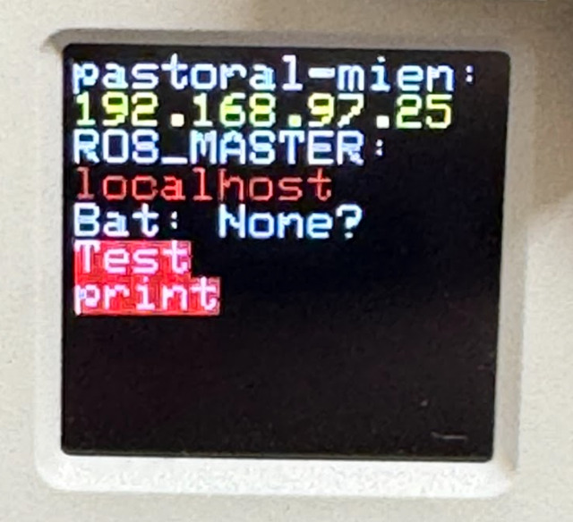

# Riberry: Robot Intelligent Binary Enhancement Resource Revolutionary Yield

## Install Riberry

### For radxa

After cloning this repository into your catkin workspace, build it:

```
catkin build riberry_startup
```

After sourcing, install the systemd-related programs with the following commands:

```
pip3 install -e .
sudo ./install.py
sudo reboot
```

You can use the dry-run option to see which scripts will be installed without actually installing them:

```
./install.py --dry-run
```

### For atom s3 and atom echo

Please write the programs found under the [firmware](https://github.com/iory/riberry/tree/main/firmware) section into the atom s3 and atom echo to display the IP and capture audio.


### Atom S3 Display

#### Additional Information

You can use ROS to publish additional information to your Atom S3 display. The following script demonstrates how to publish a message with color formatting using the `colorama` library:


```
import rospy
from std_msgs.msg import String
from colorama import Back

rospy.init_node('publisher', anonymous=True)
pub = rospy.Publisher('/atom_s3_additional_info', String, queue_size=10)
rospy.sleep(1)  # Ensure the publisher is properly set up

message = String()
message.data = Back.RED + "Test\nprint\n" + Back.RESET
pub.publish(message)
rospy.loginfo("Message published")
```

This script sets up a ROS publisher node that sends a message to the `/atom_s3_additional_info` topic.
The message text is colored red using colorama. By using ROS and colorama, you can easily publish and display colored messages on your Atom S3 display.



#### Displaying Images on Atom S3

You can also display images on your Atom S3 by setting a ROS parameter.
To display an image, you need to set the `/display_image` parameter to the desired image topic. For example:

```
rosparam set /display_image "/camera/color/image_raw"
```

This command sets the `/display_image` parameter to the `/camera/color/image_raw` topic, which will then be displayed on the Atom S3.

To revert back to the normal display (i.e., stop displaying the image), you can reset the `/display_image` parameter to an empty string:

```
rosparam set /display_image ""
```

By managing the `/display_image` parameter, you can control when and which images are displayed on your Atom S3.

##### Button States for `/atom_s3_button_state` Topic

The `/atom_s3_button_state` topic publishes messages of type `std_msgs/Int32`. The value corresponds to different button states as shown in the table below:


| Button State        | Value   |
|---------------------|---------|
| Not Changed         | 0       |
| Clicked 1-10 Times  | 1-10    |
| Long Pressed        | 11      |
| Released            | 12      |
| Reset               | 13      |

##### AtomS3 mode for `/atom_s3_mode` Topic

AtomS3 has multiple modes, which can be switched with a long click. You can get which mode AtomS3 is in by topic. The `/atom_s3_mode` topic publishes messages of type `std_msgs/String`. You can use `/atom_s3_mode` as well as `/atom_s3_button_state` to define robot operations.

##### Analyze Core Dump

Riberry provides a tool to read and analyze core dumps from supported devices (e.g., M5Stack-Basic, Atom S3). `riberry-analyze-core-dump` allows you to retrieve
core dump information and generate a clickable GitHub issue link for reporting.

Run the script to analyze a core dump:

```bash
riberry-analyze-core-dump
```

You can optionally specify an ELF file for additional debugging information:

```bash
riberry-analyze-core-dump --elf-path /path/to/firmware.elf
```

Here’s an example of what the tool outputs when run on a Radxa Zero:

```
Core dumped Firmware version: 20df8eb
LCD rotation: 1
Use Grove: 0
Device: Radxa Zero
Communication: I2CBase

PC      : 0x4209c205  PS      : 0x00060030  A0      : 0x820092bc  A1      : 0x3fcab140
A2      : 0x3fc9b2f0  A3      : 0x3fc9b410  A4      : 0x3fc9b380  A5      : 0x00000004
A6      : 0x3fcedf28  A7      : 0x80000001  A8      : 0x00000000  A9      : 0x3fcf5720
A10     : 0x00060023  A11     : 0x00000003  A12     : 0x00060023  A13     : 0x80000000
A14     : 0x00000000  A15     : 0x00ffffff  SAR     : 0x00000000  EXCCAUSE: 0x0000001d
EXCVADDR: 0x00000000  LBEG    : 0x00000000

Click here to create a GitHub issue
```

Feel free to create a GitHub issue.

## Distribute radxa image as SD card

When distributing images, it's necessary to adjust the disk size among other parameters initially due to writing to an SD card.
The `resize-helper.service` is a tool designed for this purpose. To enable this, please use the `--enable-oneshot` option to activate these settings.
Additionally, the `change-hostname-helper.service`, which randomly changes the hostname, will also be enabled.

Run the following command just before making SD cards for distribution:

```
sudo ./install.py --enable-oneshot
```

If you are concerned about the security of the network:
```
# sudo rm -f /etc/NetworkManager/system-connections/*
```

## Install wifi-connect

```
sudo apt install -y curl unzip
curl https://gist.githubusercontent.com/708yamaguchi/5dc14b90fedc30ca6785f8f7fb741627/raw/71de8351897517721c23bc6fe12f974ed6582a3a/radxa-install.sh | bash
```

## Contributing

### Automatic Formatting
riberry uses `ruff` for both linting and formatting which is configured in `pyproject.toml`, you can run with:
```
ruff format
ruff check --fix .
```

### Clang-Format
To install `clang-format`, you can use the following command:
```
pip install clang-format
```

Once installed, you can format your files using a `.clang-format` configuration file. To format a file, run:
```
clang-format -i <filename>
```

Replace `<filename>` with the name of the file you want to format. The `-i` option tells `clang-format` to edit the file in place.
